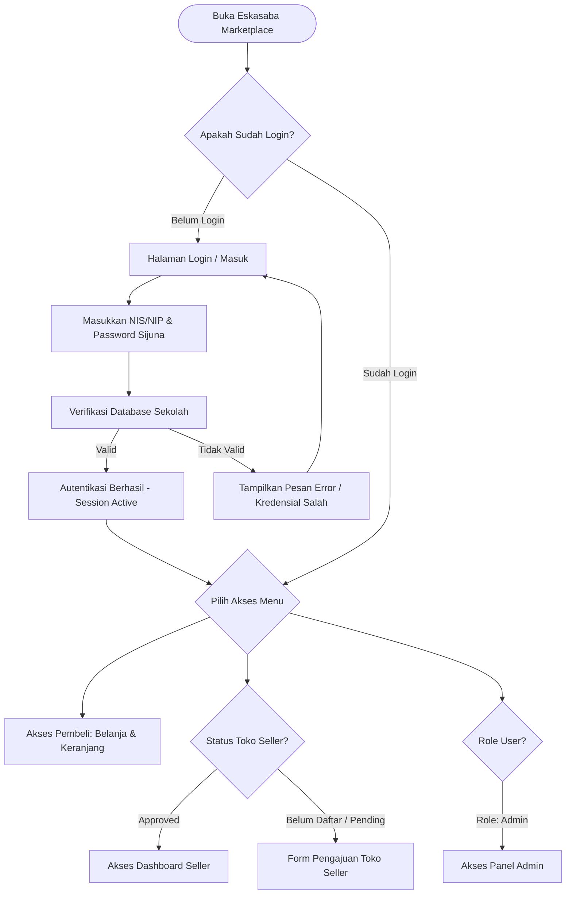
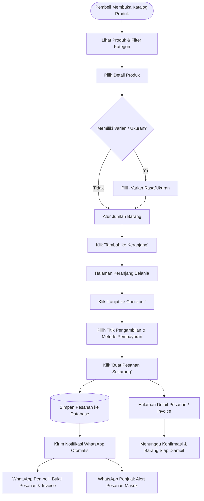
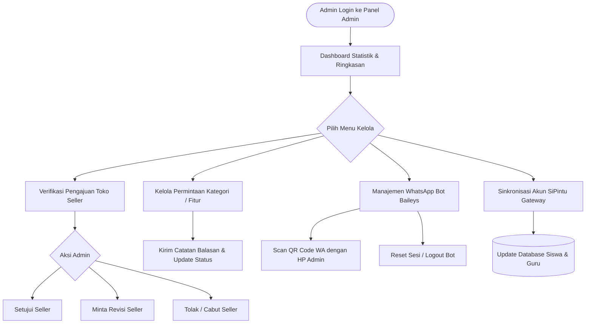
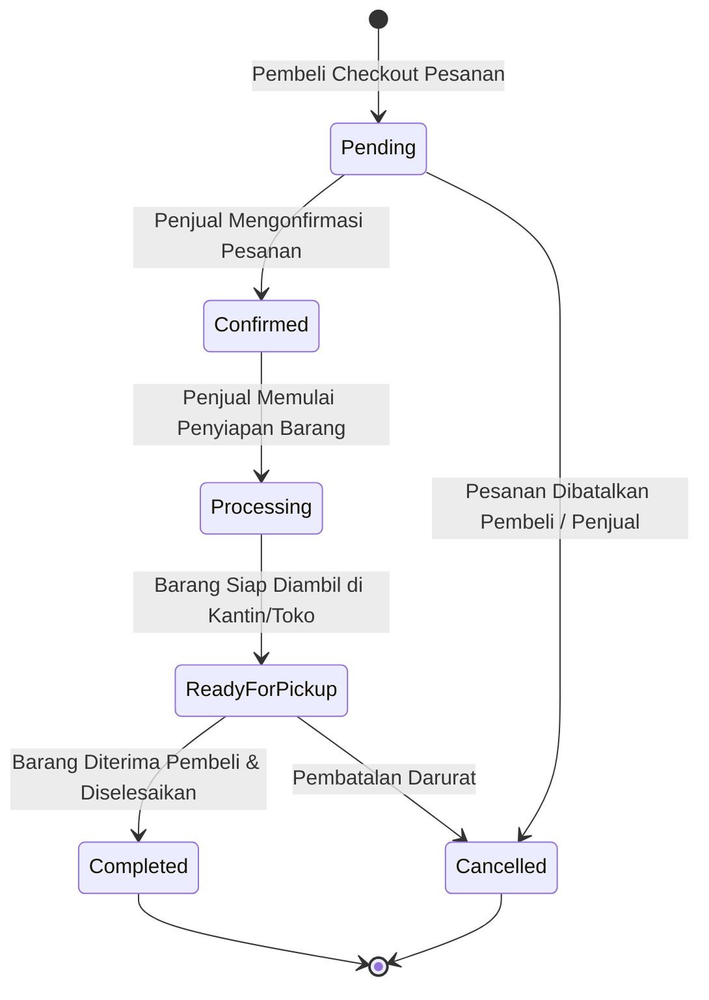
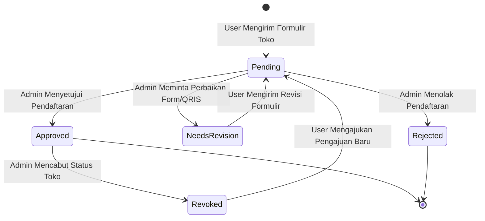

# 🔀 Flowchart & User Journey - Eskasaba Marketplace

Dokumentasi lengkap mengenai alur pengguna (*User Flowchart*), *State Diagram*, arsitektur role, dan alur transaksi pada platform **Eskasaba Marketplace (SMKN 1 Bangsri)**.

---

## 🏗️ 1. Struktur Role & Komponen Utama

```text
eskasaba-marketplace/
├── app/
│   ├── Http/Controllers/
│   │   ├── Admin/                      # Pengelolaan Admin Panel (User, Seller, Request, WA Bot)
│   │   │   ├── AnnouncementController.php
│   │   │   ├── CategoryController.php
│   │   │   ├── OrderController.php
│   │   │   ├── RequestController.php
│   │   │   ├── SellerController.php
│   │   │   ├── UserController.php
│   │   │   ├── WebsiteSettingController.php
│   │   │   └── WhatsAppController.php
│   │   ├── Buyer/                      # Fitur Pembeli (Cart, Checkout, Order, Review)
│   │   │   ├── CartController.php
│   │   │   ├── CheckoutController.php
│   │   │   ├── OrderController.php
│   │   │   └── ReviewController.php
│   │   └── Seller/                     # Dashboard & Manajemen Toko Penjual
│   │       ├── DashboardController.php
│   │       ├── OrderController.php
│   │       ├── PickupScheduleController.php
│   │       ├── ProductController.php
│   │       └── SellerRequestController.php
├── resources/views/
│   ├── admin/                          # View Antarmuka Admin
│   ├── auth/                           # View Login Student/Teacher & Admin
│   ├── buyer/                          # View Keranjang, Checkout, Order History
│   ├── components/                     # Component Blade (Navbar, Footer, Modal, Alert)
│   ├── products/                       # Katalog Produk & Detail Produk
│   ├── profile/                        # Profil User, Activity Logs, Pengajuan Seller
│   └── seller/                         # Dashboard Seller, Tambah Produk, Olah Pesanan
└── routes/
    ├── admin.php                       # Middleware: ['auth', 'role:admin']
    ├── buyer.php                       # Middleware: ['auth']
    ├── seller.php                      # Middleware: ['auth', 'seller.approved']
    └── web.php                         # Route Publik (Beranda, Katalog, Detail Produk, Guide)
```

---

## 🔄 2. Alur Pengguna (User Flowcharts)

### 1️⃣ Alur Autentikasi & Akun Sekolah (Sijuna / SiPintu)



---

### 2️⃣ Alur Pembeli (Buyer Journey - Belanja & Checkout)



---

### 3️⃣ Alur Penjual (Seller Journey - Olah Produk & Pesanan)

```mermaid
flowchart TD
    StartSeller([User Mengajukan Toko Seller]) --> FillApplyForm[Isi Nama Toko, Alasan & Upload QRIS]
    FillApplyForm --> WaitAdminVerif[Status: Pending Verifikasi Admin]
    
    WaitAdminVerif --> AdminDecision{Keputusan Admin}
    AdminDecision -- Disetujui --> SellerApproved[Status: Approved - Akses Dashboard Seller]
    AdminDecision -- Minta Revisi --> RevisionNotice[Notifikasi Revisi WA] --> FillApplyForm
    AdminDecision -- Ditolak --> RejectNotice[Notifikasi Ditolak WA]
    
    SellerApproved --> SellerAction{Pilih Aksi Seller}
    
    SellerAction --> AddProduct[Tambah Produk Baru]
    AddProduct --> ConfigVariants[Atur Harga Tunggal / Harga per Varian Size]
    ConfigVariants --> UploadImages[Upload Foto Produk (Maks 5 Foto)]
    UploadImages --> SaveProduct[(Simpan Produk ke Katalog)]
    
    SellerAction --> ProcessOrders[Kelola Pesanan Masuk]
    ProcessOrders --> UpdateStatus[Ubah Status Pesanan]
    UpdateStatus --> StatusChoice{Status Baru}
    
    StatusChoice --> ConfirmOrd[Dikonfirmasi]
    StatusChoice --> ProcOrd[Sedang Diproses]
    StatusChoice --> ReadyOrd[Siap Diambil]
    StatusChoice --> CompleteOrd[Selesai & Diserahterimakan]
    
    UpdateStatus --> AutoWANotify[Bot WA Otomatis Notifikasi Pembeli]
```

---

### 4️⃣ Alur Pengelolaan Admin (Admin Flowchart)



---

## 📊 3. State Diagram Status Pesanan & Toko (State Machine)

### 🏷️ State Diagram Life-Cycle Status Pesanan (Orders)



---

### 🏪 State Diagram Life-Cycle Status Toko (Sellers)



---

## ⚡ 4. Matriks Hak Akses & Fitur Pengguna (Access Matrix)

| Fitur / Modul | Tamu (Guest) | Pembeli (Siswa/Guru) | Penjual (Seller) | Admin Sekolah |
| :--- | :---: | :---: | :---: | :---: |
| **Melihat Katalog & Detail Produk** | ✅ | ✅ | ✅ | ✅ |
| **Tambah Produk ke Keranjang** | ❌ (Redir Login) | ✅ | ✅ | ✅ |
| **Checkout Pesanan & Notifikasi WA** | ❌ | ✅ | ✅ | ✅ |
| **Riwayat Pesanan & Detail Invoice** | ❌ | ✅ | ✅ | ✅ |
| **Form Pengajuan Toko Seller** | ❌ | ✅ | ✅ | ✅ |
| **Kelola Produk & Varian Harga** | ❌ | ❌ | ✅ | ✅ |
| **Kelola Status Pesanan Masuk** | ❌ | ❌ | ✅ | ✅ |
| **Kirim Request Kategori ke Admin** | ❌ | ❌ | ✅ | ✅ |
| **Verifikasi Toko & Request Seller** | ❌ | ❌ | ❌ | ✅ |
| **Monitoring & Scan QR WA Bot** | ❌ | ❌ | ❌ | ✅ |
| **Sinkronisasi Akun SiPintu** | ❌ | ❌ | ❌ | ✅ |
