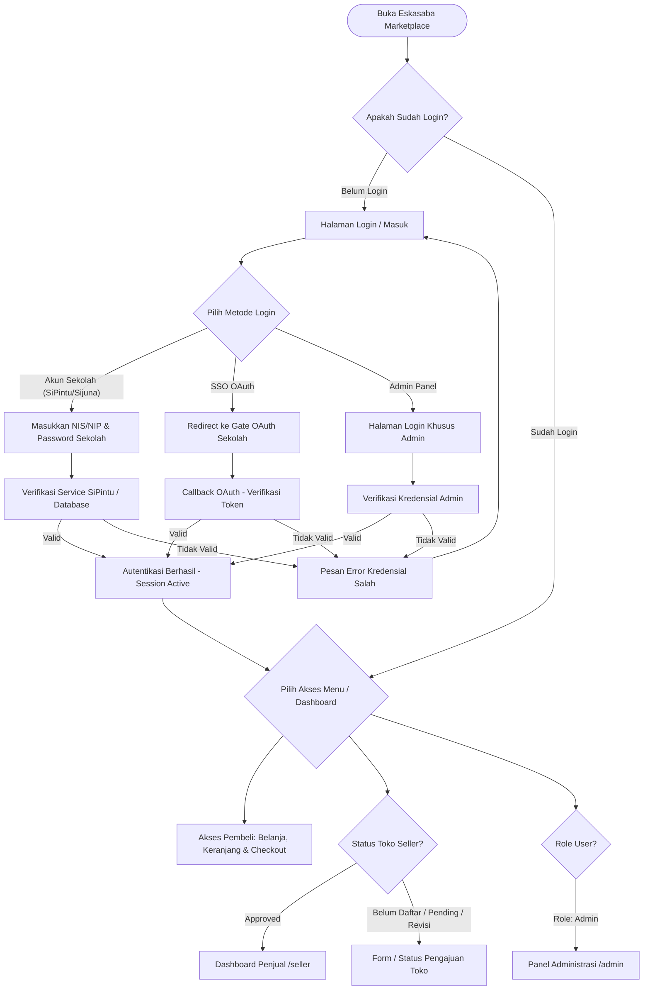
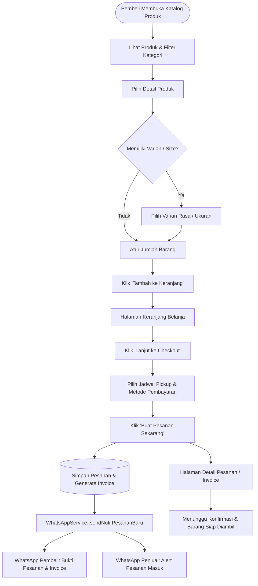
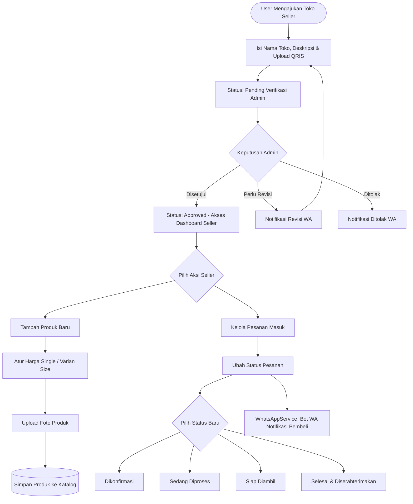
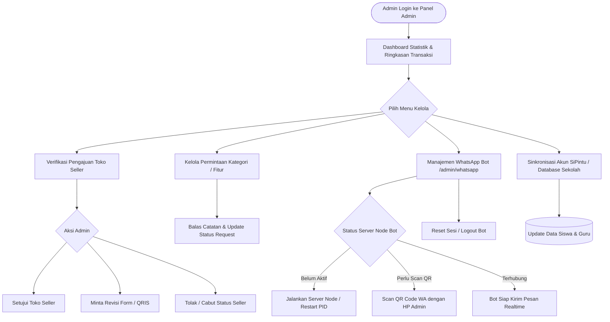
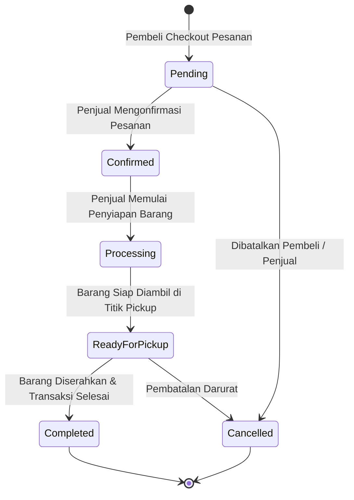

# 🔀 Flowchart & User Journey - Eskasaba Marketplace

Dokumentasi lengkap mengenai alur pengguna (*User Flowchart*), *State Diagram*, arsitektur role, dan alur transaksi pada platform **Eskasaba Marketplace (SMKN 1 Bangsri)**.

---

## 🏗️ 1. Struktur Role & Komponen Utama

```text
eskasaba-marketplace/
├── app/
│   ├── Http/Controllers/
│   │   ├── Admin/                      # Panel Administrasi (User, Seller, Request, Pembayaran, WA Bot)
│   │   │   ├── CategoryController.php
│   │   │   ├── DashboardController.php
│   │   │   ├── OrderController.php
│   │   │   ├── PaymentController.php
│   │   │   ├── ReportController.php
│   │   │   ├── SellerController.php
│   │   │   ├── SellerRequestController.php
│   │   │   ├── UserController.php
│   │   │   ├── WebsiteSettingController.php
│   │   │   └── WhatsAppController.php
│   │   ├── Api/                        # Callback Webhook API (Payment Gateway & SiPintu)
│   │   │   ├── PaymentCallbackController.php
│   │   │   └── SiPintuWebhookController.php
│   │   ├── Auth/                       # Autentikasi Pengguna & SSO Sekolah
│   │   │   ├── AdminLoginController.php
│   │   │   ├── DashboardRedirectController.php
│   │   │   ├── SchoolCallbackController.php
│   │   │   └── SchoolLoginController.php
│   │   ├── Buyer/                      # Fitur Pembeli (Cart, Checkout, Order, Review)
│   │   │   ├── CartController.php
│   │   │   ├── CheckoutController.php
│   │   │   ├── DashboardController.php
│   │   │   ├── OrderController.php
│   │   │   └── ReviewController.php
│   │   ├── Seller/                     # Dashboard & Manajemen Toko Penjual
│   │   │   ├── DashboardController.php
│   │   │   ├── OrderController.php
│   │   │   ├── PaymentController.php
│   │   │   ├── PickupScheduleController.php
│   │   │   ├── ProductController.php
│   │   │   ├── ProfileController.php
│   │   │   └── SellerRequestController.php
│   │   ├── HomeController.php
│   │   ├── NotificationController.php
│   │   ├── OAuthController.php
│   │   ├── ProfileController.php
│   │   └── SellerApplicationController.php
│   ├── Models/                         # Model Data (Order, Seller, Product, User, Payment, dll.)
│   └── Services/                       # Service Layer
│       ├── ImageCompressor.php
│       ├── SchoolApiService.php
│       ├── SiPintuService.php
│       ├── WhatsAppBotService.php       # Pengecekan status proses Node, QR Code, PID control
│       └── WhatsAppService.php          # Formatting nomor HP, template pesan, REST client ke Bot WA
├── resources/views/
│   ├── admin/                          # View Panel Administrasi
│   ├── auth/                           # View Login Siswa/Guru & Admin
│   ├── buyer/                          # View Keranjang, Checkout, Detail Pesanan
│   ├── components/                     # Component Blade (Navbar, Footer, Modal, Badge, OrderCard)
│   ├── products/                       # Katalog Produk & Detail Produk
│   ├── profile/                        # Profil User, Activity Logs, Pengajuan Toko
│   └── seller/                         # Dashboard Seller, Tambah Produk, Kelola Pesanan
├── routes/
│   ├── admin.php                       # Middleware: ['auth', 'role:admin']
│   ├── api.php                         # Route Webhook & Integration API
│   ├── auth.php                        # Route Login, Callback SSO, Logout
│   ├── buyer.php                       # Middleware: ['auth']
│   ├── guest.php                       # Route Akses Publik Tanpa Login
│   ├── seller.php                      # Middleware: ['auth', 'seller.approved']
│   └── web.php                         # Entrypoint Utama Rute Web
└── whatsapp-bot/                       # Microservice WhatsApp Bot (Node.js Express + Baileys WS)
    ├── auth_info_baileys/              # Folder Sesi WhatsApp Web Socket
    ├── logs/                           # Log Aktivitas Microservice
    ├── bot_state.json                  # Catatan Status Sesi Microservice
    └── index.js                        # REST Server API Baileys
```

---

## 🔄 2. Alur Pengguna (User Flowcharts)

### 1️⃣ Alur Autentikasi & Akun Sekolah (Sijuna / SiPintu / SSO)



---

### 2️⃣ Alur Pembeli (Buyer Journey - Belanja, Checkout & Notifikasi)



---

### 3️⃣ Alur Penjual (Seller Journey - Pendaftaran, Produk & Pesanan)



---

### 4️⃣ Alur Pengelolaan Admin (Admin Flowchart)



---

## 📊 3. State Diagram Status Pesanan & Toko (State Machine)

### 🏷️ State Diagram Life-Cycle Status Pesanan (Orders)



---

### 🏪 State Diagram Life-Cycle Status Toko (Sellers)


---

## ⚡ 4. Matriks Hak Akses & Fitur Pengguna (Access Matrix)

| Fitur / Modul | Tamu (Guest) | Pembeli (Siswa/Guru) | Penjual (Seller) | Admin Sekolah |
| :--- | :---: | :---: | :---: | :---: |
| **Melihat Katalog & Detail Produk** | ✅ | ✅ | ✅ | ✅ |
| **Tambah Produk ke Keranjang** | ❌ (Redir Login) | ✅ | ✅ | ✅ |
| **Checkout Pesanan & Notifikasi WA** | ❌ | ✅ | ✅ | ✅ |
| **Riwayat Pesanan & Detail Invoice** | ❌ | ✅ | ✅ | ✅ |
| **Form Pengajuan Toko Seller** | ❌ | ✅ | ✅ | ✅ |
| **Kelola Produk & Varian Harga** | ❌ | ❌ | ✅ | ✅ |
| **Kelola Status Pesanan Masuk** | ❌ | ❌ | ✅ | ✅ |
| **Kirim Request Kategori ke Admin** | ❌ | ❌ | ✅ | ✅ |
| **Verifikasi Toko & Request Seller** | ❌ | ❌ | ❌ | ✅ |
| **Monitoring & Control QR WA Bot** | ❌ | ❌ | ❌ | ✅ |
| **Sinkronisasi Akun SiPintu** | ❌ | ❌ | ❌ | ✅ |
