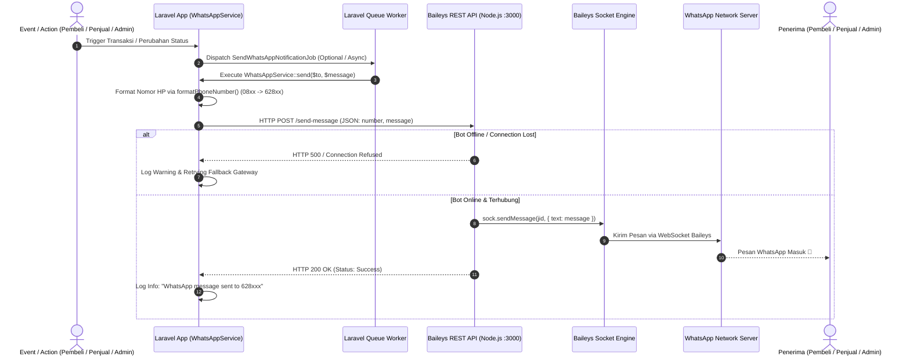

# 📱 WhatsApp Bot Integration Guide - Eskasaba Marketplace

Panduan teknis pengintegrasian microservice **WhatsApp Bot (Baileys Node.js)** dengan aplikasi web **Eskasaba Marketplace (Laravel)** untuk otomatisasi notifikasi transaksi, pendaftaran toko, dan update status pesanan.

---

## 🏗️ 1. Struktur Folder & Komponen Utama

```text
eskasaba-marketplace/
├── app/
│   ├── Http/Controllers/Admin/
│   │   └── WhatsAppController.php          # Controller manajemen status bot & QR Code WA di Admin Panel
│   ├── Jobs/
│   │   └── SendWhatsAppNotificationJob.php    # Queue Job pengiriman pesan WA secara asynchronous
│   ├── Models/
│   │   ├── Order.php                       # Model Pesanan
│   │   ├── Seller.php                      # Model Toko / Penjual
│   │   ├── SellerRequest.php               # Model Permintaan Kategori / Fitur Seller
│   │   └── User.php                        # Model Pengguna (Menyimpan nomor HP/WA)
│   └── Services/
│       └── WhatsAppService.php             # Service utama formatting nomor, template pesan, & HTTP Client ke Bot
├── config/
│   └── services.php                        # Konfigurasi WA_ENABLE_NOTIFICATION, WA_GATEWAY_URL, & WA_GATEWAY_TOKEN
├── resources/views/admin/whatsapp/
│   └── index.blade.php                     # Dashboard monitoring bot WA, scan QR Code, & kontrol sesi
├── routes/
│   └── admin.php                           # Route admin untuk kontrol WA Bot (/admin/whatsapp)
└── whatsapp-bot/
    ├── auth_info_baileys/                  # Folder sesi & kredensial Baileys WhatsApp (auto-generated)
    ├── index.js                            # Server Express REST API + Baileys WhatsApp Web Socket Engine
    ├── package.json                        # Dependensi Node.js (@whiskeysockets/baileys, express, qrcode)
    └── .env                                # Environment variabel PORT & API Key Bot
```

---

## 🔄 2. Alur Komunikasi (Laravel → Baileys → WhatsApp Network)



---

## 📱 3. Logika Format Nomor Telepon (Indonesian Standard)

Semua nomor telepon pengguna secara otomatis diproses melalui method `WhatsAppService::formatPhoneNumber()` sebelum dikirimkan ke Gateway WhatsApp:

- `081234567890` `→` `6281234567890`
- `+6281234567890` `→` `6281234567890`
- `6281234567890` `→` `6281234567890`
- `81234567890` `→` `6281234567890`

> ⚠️ **Catatan Penting**: Nomor telepon yang kosong (`null`), berformat tidak valid, atau mengandung karakter non-digit secara otomatis dibatalkan pengirimannya dan dicatat dalam Laravel Application Logs (`storage/logs/laravel.log`) dengan pesan warning: `"WhatsAppService: Nomor tujuan tidak valid."`

---

## ✉️ 4. Format Pesan WhatsApp & Event Triggers

### 1️⃣ Notifikasi Pesanan Baru (New Order)
- **Trigger**: Pembeli berhasil melakukan checkout pesanan.
- **Penerima**: Penjual (Seller) & Pembeli (Buyer).

```text
🛍️ *PESANAN BARU MASUK!*

Halo *[Nama Seller]*,
Anda mendapatkan pesanan baru di Eskasaba Marketplace!

📄 *Invoice:* #[Nomor Invoice]
👤 *Pembeli:* [Nama Pembeli]
📱 *No. HP/WA Pembeli:* [No HP]
📍 *Lokasi & Waktu Pengambilan:* [Lokasi COD / Kantin]
💰 *Total:* Rp [Total Harga]

📋 *Item Pesanan:*
• [Nama Produk] [Pilihan Varian/Rasa] (x[Qty])

Silakan periksa panel Seller Anda untuk memproses pesanan ini.
🌐 http://eskamart.smkn1bangsri.sch.id/
```

---

### 2️⃣ Notifikasi Update Status Pesanan
- **Trigger**: Penjual memperbarui status pesanan (*Confirmed*, *Processing*, *Ready for Pickup*, *Completed*, atau *Cancelled*).
- **Penerima**: Pembeli (Buyer).

```text
📦 *UPDATE STATUS PESANAN*

Halo *[Nama Pembeli]*,
Status pesanan *#[Nomor Invoice]* Anda telah diperbarui menjadi:
👉 *[Status Pesanan: Siap Diambil di Kantin/Toko 🎒]*

🏪 *Toko Penjual:* [Nama Toko/Seller]
📱 *No. HP/WA Penjual:* [No WA Seller]
📍 *Titik Pengambilan:* [Lokasi]

📋 *Item:*
• [Nama Produk] (x[Qty])

Terima kasih telah berbelanja di Eskasaba Marketplace!
🌐 http://eskamart.smkn1bangsri.sch.id/
```

---

### 3️⃣ Notifikasi Pengajuan Toko Seller
- **Trigger**: Siswa/Guru mengirimkan formulir pendaftaran toko Seller baru.
- **Penerima**: Pendaftar & Admin Sekolah.

```text
📝 *PENGAJUAN SELLER BERHASIL DIKIRIM*

Halo *[Nama Pendaftar]*,
Pengajuan toko Anda di Eskasaba Marketplace telah berhasil dikirim.
Tim Admin Sekolah akan melakukan verifikasi dalam 1×24 jam.

Status pengajuan Anda saat ini: *PENDING VERIFIKASI*.
```

---

### 4️⃣ Notifikasi Hasil Verifikasi Seller oleh Admin
- **Trigger**: Admin menyetujui, meminta revisi, atau menolak pendaftaran toko Seller.
- **Penerima**: Pendaftar & Admin.

```text
🎉 *PENGAJUAN SELLER DISETUJUI!*

Selamat *[Nama Seller]*!
Pengajuan toko Anda di Eskasaba Marketplace telah *DISETUJUI* oleh Admin.
Anda sekarang dapat mulai menambah produk dan berjualan online melalui Dashboard Seller Anda.

Selamat berjualan!
```

---

### 5️⃣ Notifikasi Request Kategori / Fitur dari Seller
- **Trigger**: Seller mengirimkan permohonan penambahan kategori produk baru atau fitur toko.
- **Penerima**: Admin Sekolah & Seller.

```text
📬 *REQUEST SELLER BARU! (Kategori / Fitur)*

Halo Admin, toko *[Nama Toko]* baru saja mengirimkan request baru:

📌 *Tipe:* Request Kategori Produk
🏷️ *Nama Kategori / Judul:* Kerajinan Tangan Siswa
📝 *Keterangan:* Mohon ditambahkan kategori untuk produk rajut karya jurusan Busana.

Silakan periksa dan beri tanggapan melalui Panel Admin Eskasaba Marketplace.
🌐 http://eskamart.smkn1bangsri.sch.id/admin/seller-requests
```

---

## ⚙️ 5. Konfigurasi Environment & Jalankan Bot

### 1. File `.env` (Laravel Core)
```env
WA_ENABLE_NOTIFICATION=true
WA_GATEWAY_URL=http://localhost:3000/send-message
WA_GATEWAY_TOKEN=secret-eskamart-token-2026
```

### 2. File `whatsapp-bot/.env` (Node.js Service)
```env
PORT=3000
API_KEY=secret-eskamart-token-2026
```

### 3. Perintah Menjalankan Microservice WA Bot
```bash
# Pindah ke direktori bot
cd whatsapp-bot

# Install dependensi (jika belum)
npm install

# Jalankan server bot
npm start
```

---

## 🔧 6. Manajemen & Troubleshooting Bot di Panel Admin

Admin dapat mengelola seluruh sesi koneksi WhatsApp Bot langsung dari antarmuka web di `/admin/whatsapp`:

1. **Status Realtime**: Menampilkan status *Terhubung*, *Menunggu Scan QR*, *Menghubungkan*, atau *Nonaktif*.
2. **Scan QR Code**: Render otomatis gambar QR Code Baileys untuk dipindai menggunakan aplikasi WhatsApp di HP Admin.
3. **Reset Sesi / Logout**: Tombol hapus folder `auth_info_baileys` secara aman jika koneksi terputus atau akun berganti.
