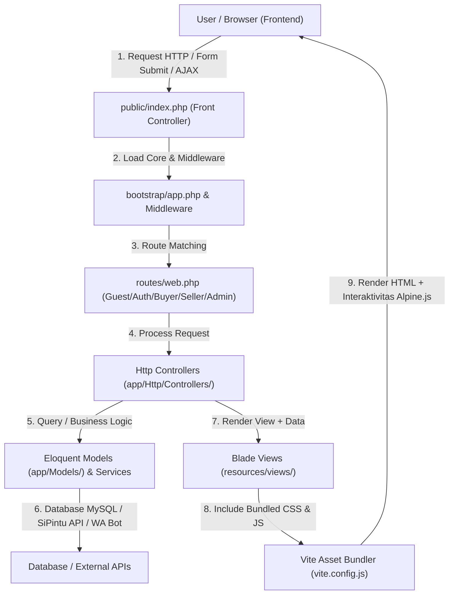

# 📄 Ringkasan Fungsionalitas File - Eskasaba Marketplace

Dokumen ini berisi ringkasan fungsionalitas seluruh file utama dalam sistem **Eskasaba Marketplace (SMK Negeri 1 Bangsri)**. Penjelasan difokuskan pada alur kerja setiap file, arsitektur modul, serta cara kerja penggabungan antara **Frontend** (Blade View, Tailwind CSS, Alpine.js, JavaScript) dan **Backend** (Laravel Controllers, Eloquent Models, Middleware, Services, Bot Microservice).

---

## 🔄 1. Arsitektur Hubungan Frontend & Backend (Core Bridge & Request Flow)

Bagaimana Frontend dan Backend terhubung dan bekerja bersama dalam aplikasi ini?

### File-File Utama Pengelola Hubungan Frontend–Backend:

1. **`public/index.php`**
   * **Kegunaan:** Titik masuk utama (*Front Controller*) untuk seluruh HTTP request yang datang dari web server (Nginx/Apache). Menginisialisasi *Composer Autoloader* dan menjalankan aplikasi Laravel.
2. **`bootstrap/app.php`**
   * **Kegunaan:** Konfigurasi dasar bootstrap Laravel 11. Menghubungkan seluruh file rute (`routes/web.php`, `api.php`, `console.php`), memuat middleware global (seperti `IsolateSession`), mendaftarkan middleware alias (`role`, `seller.approved`), mengkonfigurasi pengalihan login/dashboard, serta mendaftarkan pengecualian proteksi CSRF untuk webhook & callback.
3. **`routes/web.php`**
   * **Kegunaan:** File induk rute web. Menggabungkan file rute terpisah berdasarkan peran dan konteks (`guest.php`, `auth.php`, `buyer.php`, `seller.php`, `admin.php`).
4. **`vite.config.js`**
   * **Kegunaan:** Konfigurasi pembundel aset (*Asset Bundler*) Vite. Mengompilasi `resources/css/app.css`, `resources/js/app.js`, dan `resources/js/passkeys.js` menjadi aset produksi yang di-inject ke tampilan Blade melalui arahan `@vite()`.
5. **`resources/views/components/layouts/app.blade.php`**
   * **Kegunaan:** Layout utama frontend yang menjadi jembatan visual. Mengimpor font, icon FontAwesome, Alpine.js, CSRF meta token, aset Vite (`app.css`, `app.js`), serta merender `<x-navbar />`, `<x-footer />`, slot konten `{{ $slot }}`, dan sistem toast alert flash message dari session backend.
6. **`resources/js/app.js`**
   * **Kegunaan:** Skrip JavaScript utama di sisi client (Frontend). Mengatur interaktivitas UI seperti *auto-dismiss notification toast* secara konstan menggunakan `MutationObserver` dan logika skrip tambahan.
7. **`resources/css/app.css`**
   * **Kegunaan:** File sumber styling Tailwind CSS v4 dan kustomisasi gaya tampilan marketplace (layout responsif, glassmorphism, warna tema, serta komponen visual).
8. **`app/Providers/AppServiceProvider.php`**
   * **Kegunaan:** Menyediakan data global backend ke seluruh Blade Views (seperti `WebsiteSetting` global untuk nama website, logo, favicon) melalui *View Share* sehingga variabel tersebut dapat diakses di semua tampilan tanpa perlu dipassing ulang dari controller.

---

## 🔀 2. Routing System (File-File Rute - `routes/`)

File rute memetakan URL yang diakses oleh pengguna ke Controller backend yang tepat:

* **`routes/web.php`**: File penggabung utama yang meng-include rute-rute modular di bawah ini.
* **`routes/guest.php`**: Menangani rute publik tanpa autentikasi (Landing Page `/`, Katalog Produk `/products`, Detail Produk `/products/{slug}`, Etalase Seller `/sellers/{id}`, Halaman Tentang `/about`, Panduan `/guide`).
* **`routes/auth.php`**: Menangani alur login SSO SiPintu Gateway (`/auth/school/redirect`, `/auth/school/callback`), login admin (`/admin/login`), serta logout.
* **`routes/buyer.php`**: Menangani rute khusus Pembeli (Keranjang `/cart`, Checkout `/checkout`, Pesanan Saya `/orders`, Ulasan `/reviews`, Pengajuan Toko `/apply-seller`, Edit Profil `/profile`).
* **`routes/seller.php`**: Menangani rute khusus Penjual/Toko (`/seller/dashboard`, Kelola Produk `/seller/products`, Pesanan Masuk `/seller/orders`, Pengaturan Jadwal Pickup `/seller/pickup-schedules`, Laporan Omset `/seller/reports`, Request ke Admin `/seller/requests`).
* **`routes/admin.php`**: Menangani rute khusus Administrator (`/admin/dashboard`, Manajemen User `/admin/users`, Verifikasi Toko `/admin/sellers`, Kategori `/admin/categories`, Transaksi `/admin/orders`, Pembayaran `/admin/payments`, Setting Website `/admin/website-settings`, Panel WhatsApp Bot `/admin/whatsapp`, Audit Log `/admin/login-logs`).
* **`routes/api.php`**: Endpoint API internal & Webhook (Callback Pembayaran `/api/payment/callback`, Callback OAuth, Sinkronisasi SiPintu).
* **`routes/console.php`**: Tempat pendaftaran perintah terjadwal (*Artisan Cron Scheduler*).

---

## 🧠 3. Pengendali Logika (Controllers - `app/Http/Controllers/`)

Controller menerima request dari rute, mengolah data bersama Model/Service, dan mengembalikan respon berupa View Blade atau JSON API.

### 🔑 Autentikasi & Redirect (`app/Http/Controllers/Auth/`)
* **`SchoolLoginController.php`**: Mengarahkan pengguna ke halaman OAuth SiPintu Gateway sekolah.
* **`SchoolCallbackController.php`**: Menerima token callback dari SiPintu, melakukan verifikasi pengguna via `SchoolApiService`, membuat/meng-update akun pengguna lokal, dan mengautentikasi sesi login.
* **`AdminLoginController.php`**: Mengelola proses authentikasi masuk khusus untuk Administrator marketplace.
* **`DashboardRedirectController.php`**: Pengarah pintar yang menentukan halaman dashboard tujuan pengguna setelah berhasil login berdasarkan perannya (`admin` -> Admin Dashboard, `seller` -> Seller Dashboard, `buyer` -> Buyer Dashboard / Home).
* **`OAuthController.php`**: Pengendali alur autentikasi OAuth internal pendukung.

### 🛒 Area Pembeli / Buyer (`app/Http/Controllers/Buyer/`)
* **`CartController.php`**: Mengelola operasi keranjang belanja (menambah produk ke keranjang, memperbarui jumlah barang, menambah catatan barang, menghapus item).
* **`CheckoutController.php`**: Memproses halaman checkout, kalkulasi total belanja per toko, pemilihan metode pembayaran, serta pembuatan record pesanan (`Order`) dan item pesanan (`OrderItem`).
* **`OrderController.php`**: Menampilkan daftar transaksi pembeli, detail status pesanan, konfirmasi penerimaan barang, pembatalan pesanan, serta pengajuan refund.
* **`ReviewController.php`**: Mengelola pengiriman ulasan bintang (rating 1-5), komentar, dan foto ulasan barang yang telah diterima.
* **`DashboardController.php`**: Menampilkan statistik dan ringkasan aktivitas pembeli.

### 🏬 Area Penjual / Seller (`app/Http/Controllers/Seller/`)
* **`ProductController.php`**: Mengelola katalog toko (Tambah produk baru, Edit data/harga/stok/varian/diskon, Hapus produk, dan kompresi foto produk via `ImageCompressor`).
* **`OrderController.php`**: Menampilkan pesanan masuk untuk toko, menerima/menolak pesanan, mengubah status pesanan (Diproses, Siap Diambil, Selesai).
* **`PaymentController.php`**: Memeriksa bukti transfer pembayaran dari pembeli dan riwayat saldo pesanan.
* **`PickupScheduleController.php`**: Mengatur jadwal & waktu pengambilan barang di area sekolah (misal: TEFA/Kantin).
* **`ProfileController.php`**: Mengatur identitas toko (Nama toko, deskripsi, foto profil toko, dan QRIS pembayaran toko).
* **`ReportController.php`**: Menyajikan laporan omset, total penjualan, dan analisa statistik produk terlaris toko.
* **`SellerRequestController.php`**: Mengirimkan permohonan khusus dari seller ke admin (seperti penambahan kategori produk baru).
* **`DashboardController.php`**: Menampilkan metrik toko real-time (omset bulanan, pesanan pending, produk aktif).

### 👑 Area Administrator (`app/Http/Controllers/Admin/`)
* **`UserController.php`**: Mengelola seluruh pengguna marketplace (Siswa, Guru, Admin), ubah data, dan reset password.
* **`SellerController.php`**: Meninjau pendaftaran seller baru (Approve/Reject), verifikasi toko, serta pencabutan status seller beralasan (secara otomatis mengirim notifikasi pesan WA ke seller).
* **`SellerRequestController.php`**: Memproses permohonan fitur/kategori dari para penjual.
* **`CategoryController.php`**: Mengelola kategori produk pasar (CRUD Kategori & ikon).
* **`OrderController.php`**: Monitoring seluruh pesanan di marketplace secara global.
* **`PaymentController.php`**: Verifikasi dan pengecekan pembayaran transaksi marketplace.
* **`ReportController.php`**: Generasi laporan keuangan, rekap Penjualan, dan analisis performa marketplace.
* **`WebsiteSettingController.php`**: Pengaturan nama website, logo, favicon, kontak sekolah, serta konfigurasi operasional marketplace.
* **`WhatsAppController.php`**: Panel kontrol bot WhatsApp di admin (melihat status service PID Node.js, scan QR code Baileys, restart bot, dan tes pengiriman pesan).
* **`ActivityLogController.php`**: Menampilkan log aktivitas keamanan dan riwayat aksi pengguna.
* **`DashboardController.php`**: Menampilkan statistik utama marketplace secara menyeluruh.

### 🌐 Umum & Publik (`app/Http/Controllers/`)
* **`HomeController.php`**: Mengolah data untuk Landing Page (Banner, Kategori Populer, Produk Terbaru/Diskon).
* **`ProfileController.php`**: Pengaturan profil pribadi pengguna & pengajuan diri menjadi seller (`SellerApplicationController.php`).
* **`NotificationController.php`**: Mengelola notifikasi internal sistem bagi pengguna.
* **`Api/PaymentCallbackController.php`**: Receiver webhook status pembayaran dari payment gateway external.

---

## 📐 4. Model Data (Eloquent Models - `app/Models/`)

Model mewakili tabel pada database MySQL dan menyediakan logika relasi data:

* **`User.php`**: Data pengguna (NIS/NIP, Nama, Role, Kelas, Nomor HP, Email, Password plain sync). Memiliki relasi ke `Seller`, `Order`, `Cart`, `Review`.
* **`Seller.php`**: Data toko penjual (Nama toko, Status approval, Alasan penolakan/pencabutan, Foto toko, QRIS, Status kelulusan siswa). Relasi ke `User` dan `Product`.
* **`Product.php`**: Data barang dagangan (Nama, Slug, Harga, Stok, Diskon, Deskripsi, Varian, Kondisi). Relasi ke `Seller`, `Category`, `ProductImage`, `Review`.
* **`ProductImage.php`**: Galeri foto pendukung untuk tiap produk.
* **`Category.php`**: Data kategori produk (Nama, Slug, Icon).
* **`Cart.php` & `CartItem.php`**: Data wadah keranjang belanja pengguna dan rincian barang di dalamnya.
* **`Order.php` & `OrderItem.php`**: Data transaksi pesanan, status transaksi, total tagihan, lokasi pickup, catatan, dan rincian item barang.
* **`Payment.php`**: Data transaksi pembayaran (Metode bayar, Bukti transfer, Status konfirmasi).
* **`PickupSchedule.php`**: Data jam & lokasi pengambilan barang di sekolah.
* **`Review.php`**: Data ulasan dan rating produk dari pembeli.
* **`Notification.php`**: Data notifikasi internal untuk pengguna.
* **`ActivityLog.php`**: Catatan audit aktivitas sistem (Login, ubah data, hapus produk, pencabutan seller).
* **`SellerRequest.php`**: Permohonan seller ke admin.
* **`WebsiteSetting.php`**: Menyimpan konfigurasi dinamis aplikasi marketplace.
* **`SchoolProfile.php`**: Informasi profil identitas SMK Negeri 1 Bangsri.
* **`Admin.php`**: Data akun administrator marketplace.

---

## 🛠️ 5. Service, Helper & Middleware (`app/Services/`, `app/Helpers/`, `app/Http/Middleware/`)

* **`app/Services/SchoolApiService.php`**: Service pengelola komunikasi HTTP REST API ke **SiPintu Gateway** (Verifikasi token SSO, sinkronisasi akun NIS/NIP, sinkronisasi password).
* **`app/Services/WhatsAppService.php`**: Service pengirim notifikasi pesan WhatsApp dari Laravel ke microservice bot Node.js (digunakan saat pesanan baru, status berubah, pencabutan seller, dan peringatan kelulusan).
* **`app/Services/WhatsAppBotService.php`**: Service pembantu untuk manajemen instance bot WhatsApp (Mengecek status PID bot, mengambil QR Code string, restart proses bot).
* **`app/Services/ImageCompressor.php`**: Service otomatisasi kompresi & enkapsulasi file foto yang diunggah (Produk & QRIS) agar ukuran file menjadi optimal tanpa mengurangi kualitas visual.
* **`app/Helpers/helpers.php`**: Fungsi helper global (seperti `format_rupiah()` untuk format mata uang IDR).
* **`app/Http/Middleware/EnsureRole.php`**: Middleware untuk memastikan otorisasi pengguna sesuai role (`admin`, `seller`, `buyer`).
* **`app/Http/Middleware/EnsureSellerApproved.php`**: Middleware pencegat akses panel seller jika status toko belum disetujui, ditolak, atau dicabut oleh admin.
* **`app/Http/Middleware/IsolateSession.php`**: Middleware pemisah sesi login agar akun Admin dan Akun User/Buyer tidak saling menimpa.

---

## ⏱️ 6. Perintah Terjadwal (Artisan Commands - `app/Console/Commands/`)

* **`AutoCompleteOrdersCommand.php`** (`orders:auto-complete`): Mengubah otomatis status pesanan yang sudah diambil menjadi Selesai setelah batas waktu tertentu.
* **`NotifyGraduatingSellersCommand.php`** (`sellers:notify-graduating`): Dijalankan otomatis pada **1 April** untuk mengirimi pesan WA pengingat ke toko siswa Kelas 12 agar menyelesaikan transaksi sebelum lulus.
* **`SyncSiPintuUsersCommand.php`** (`sipintu:sync`): Sinkronisasi masal data pengguna dengan basis data SiPintu sekolah.
* **`CleanOldNotifications.php`**: Pembersih berkala untuk menghapus notifikasi lama yang sudah kadaluarsa.
* **`TestWhatsAppCommand.php`**: Perintah CLI untuk menguji konektivitas pengiriman pesan via bot WhatsApp.

---

## 🎨 7. Tampilan Frontend (Blade Views & Components - `resources/views/`)

### 🏗️ Layouts (`resources/views/components/layouts/`)
* **`app.blade.php`**: Master layout untuk Halaman Utama, Katalog, Detail Produk, Keranjang, dan Checkout.
* **`admin.blade.php`**: Master layout untuk Dashboard & Panel Kontrol Admin (dilengkapi `sidebar-admin.blade.php`).
* **`seller.blade.php`**: Master layout untuk Panel Pengelola Toko Seller (dilengkapi `sidebar-seller.blade.php`).
* **`buyer.blade.php`**: Master layout untuk Akun Pembeli (dilengkapi `sidebar.blade.php`).
* **`auth.blade.php`**: Layout khusus halaman login & registrasi.

### 🧩 Komponen Blade Reusable (`resources/views/components/`)
* **`navbar.blade.php`**: Header navigasi atas (Pencarian produk, counter keranjang belanja, counter notifikasi, menu akun).
* **`footer.blade.php`**: Bagian kaki halaman yang berisi informasi hak cipta dan navigasi cepat.
* **`product-card.blade.php`**: Komponen kartu produk (Menampilkan gambar, tag diskon, harga asli, harga diskon, nama toko, dan rating).
* **`cart-item.blade.php`**: Komponen baris item dalam keranjang belanja (Kontrol jumlah, input catatan item, tombol hapus).
* **`order-card.blade.php`**: Komponen kartu status transaksi pesanan.
* **`alert.blade.php`**: Komponen notifikasi pop-up/toast (*Success, Error, Warning, Info*).
* **`confirm-modal.blade.php`**: Modal dialog konfirmasi aksi (seperti hapus barang, konfirmasi terima pesanan).
* **`share-modal.blade.php`**: Modal untuk membagikan tautan produk ke media sosial / WA.
* **`rating.blade.php`**, **`badge.blade.php`**, **`button.blade.php`**, **`empty-state.blade.php`**: Komponen antarmuka dasar (*UI Primitives*).

### 📄 Halaman Aplikasi (`resources/views/`)
* **`home/index.blade.php`**: Landing Page pasar online.
* **`products/index.blade.php` & `show.blade.php`**: Halaman pencarian/filter produk & detail lengkap produk.
* **`buyer/cart/index.blade.php`**: Halaman pengelola keranjang belanja.
* **`buyer/checkout/index.blade.php`**: Halaman proses checkout dan bayar pesanan.
* **`buyer/orders/*`**: Halaman daftar & detail riwayat pesanan pembeli.
* **`seller/products/*`**: Form penambahan, pengeditan, dan manajemen produk toko.
* **`seller/orders/*`**: Halaman kelola pesanan masuk untuk toko.
* **`admin/sellers/*`**: Panel verifikasi & pencabutan toko beralasan oleh admin.
* **`admin/whatsapp/index.blade.php`**: Panel monitoring & QR Code Bot WhatsApp Baileys.

---

## 📱 8. Microservice Bot WhatsApp (`whatsapp-bot/`)

Aplikasi ini mengintegrasikan bot WhatsApp terpisah berbasis Node.js untuk mengirim notifikasi real-time:

1. **`whatsapp-bot/index.js`**
   * **Kegunaan:** Aplikasi Node.js menggunakan library `@whiskeysockets/baileys` dan `express`. Menyediakan REST API lokal (endpoint `/send-message`, `/status`, `/qr`, `/restart`) yang dipanggil oleh backend Laravel (`WhatsAppService.php`).
2. **`whatsapp-bot/package.json`**
   * **Kegunaan:** Manajer dependensi Node.js untuk bot WhatsApp.
3. **`whatsapp-bot/bot_state.json`**
   * **Kegunaan:** Menyimpan status riwayat runtime dan informasi sesi bot WhatsApp.

---

## 🗄️ 9. Skema Database & Migrasi (`database/`)

* **`database/migrations/*`**: File-file skrip pembentuk struktur tabel database MySQL (Tabel `users`, `sellers`, `products`, `orders`, `payments`, `reviews`, `notifications`, `activity_logs`, dll).
* **`database/seeders/DatabaseSeeder.php`**: Seeder utama yang mengkoordinasikan data pengisian awal (`AdminSeeder`, `SellerSeeder`, `CategorySeeder`, `ProductSeeder`, `SchoolProfileSeeder`, `WebsiteSettingSeeder`).

---

## 💡 Ringkasan Alur Kerja Interaktif Frontend–Backend

1. **Pengguna Membuka Halaman / Melakukan Aksi (Frontend)**:
   Pengguna menekan tombol "Tambah ke Keranjang" pada `product-card.blade.php` atau memasukkan form pada view Blade.
2. **Pengiriman Request & Keamanan**:
   Request dikirim melalui form HTTP POST atau skrip Alpine.js/AJAX dengan membawa **CSRF Token** (`<meta name="csrf-token">`).
3. **Penyaringan Middleware & Rute (Bridge Core)**:
   Request diterima di `public/index.php`, diproses oleh `bootstrap/app.php`, disaring oleh middleware (`IsolateSession`, `EnsureRole`), lalu diarahkan oleh `routes/buyer.php` ke `CartController@store`.
4. **Pengolahan Backend & Database**:
   `CartController` memvalidasi input, lalu memperbarui data pada database MySQL melalui model `Cart` dan `CartItem`.
5. **Respon Kembali ke Frontend**:
   Controller mengembalikan respon pengalihan (*redirect*) disertai pesan flash `session('success', 'Produk berhasil ditambahkan!')`.
6. **Rendering Visual & Toast Alert (Frontend)**:
   Layout `app.blade.php` menangkap pesan flash session, merender komponen `<x-alert>`, dan skrip `resources/js/app.js` secara otomatis memunculkan toast serta menghapusnya secara halus setelah 5 detik.
